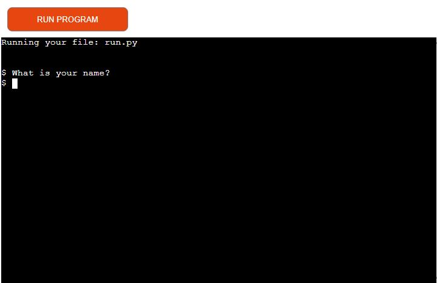
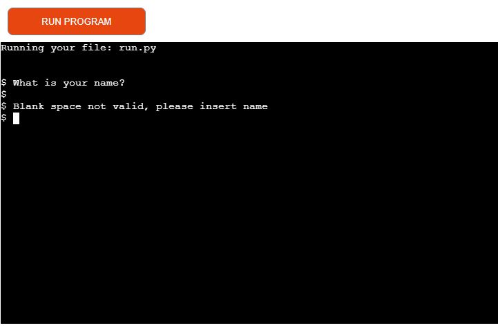
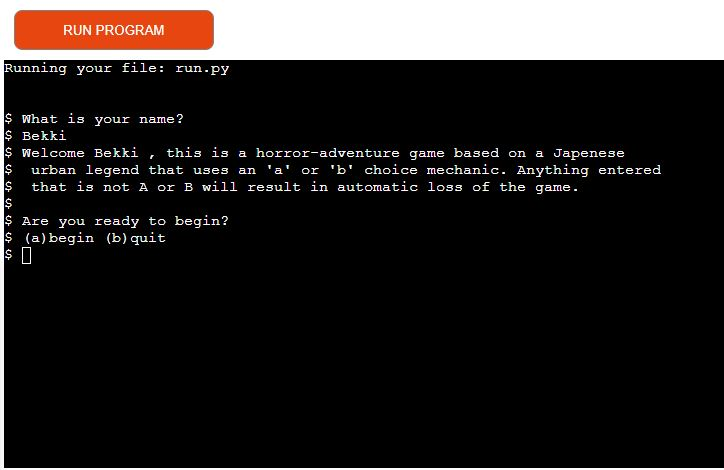
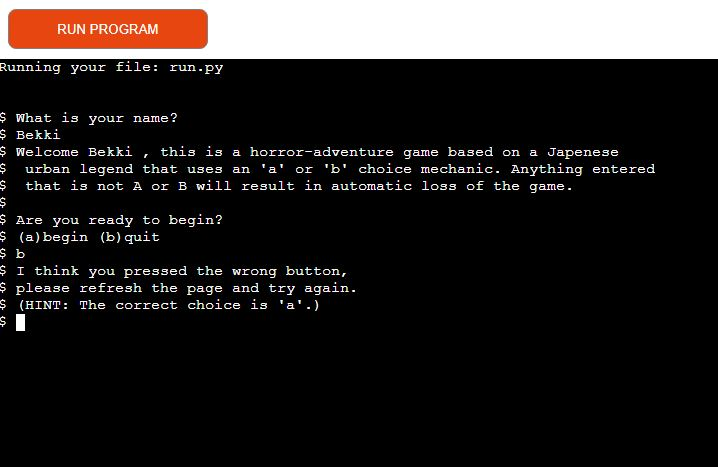
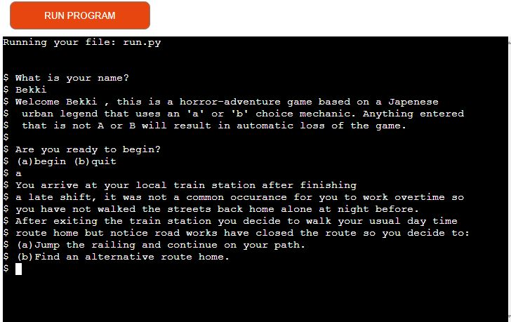
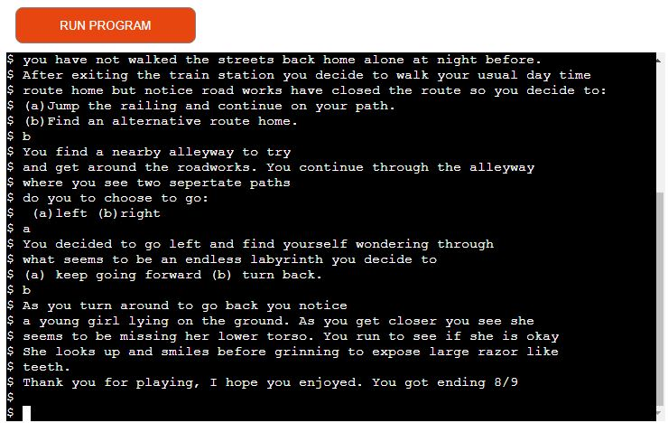
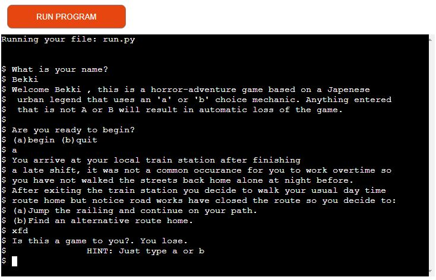
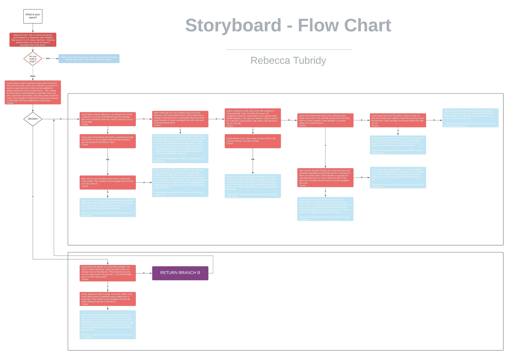
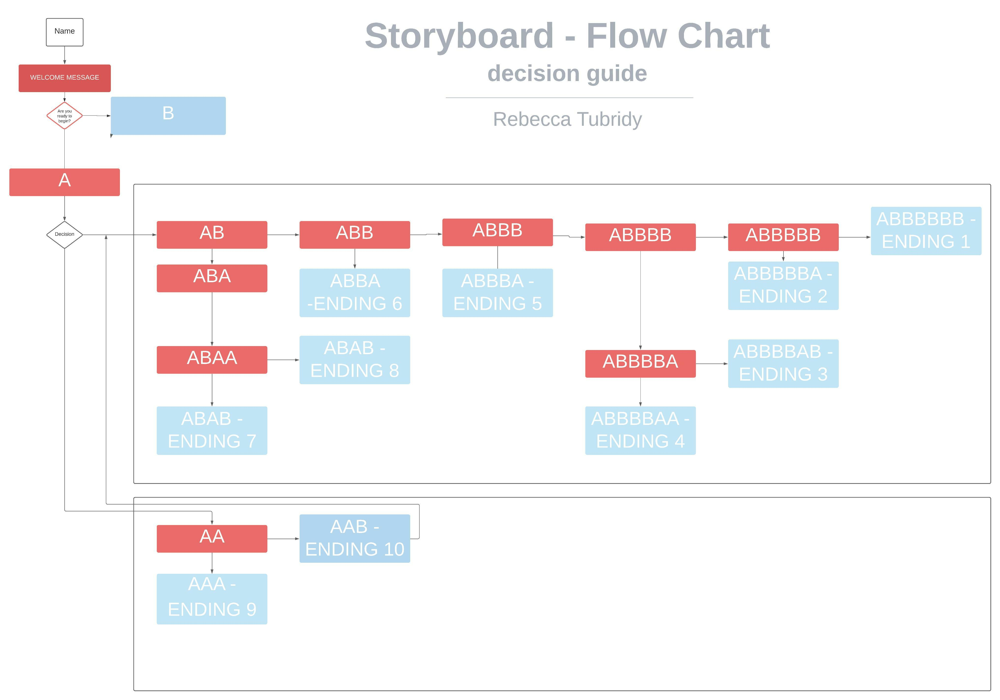
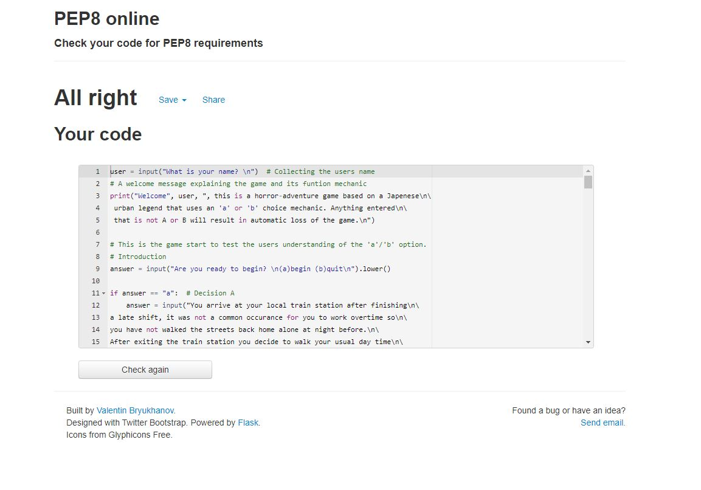

# Horror Adventure Game
This project is a horror story game that has multiple branches available, the story is loosely based on a Japanese horror story known as the "Teke-Teke".
The premise of the story is the user must pick the correct answer to get themselves home safely.
The game is fully built on "If" statements, nested together to create a branching story system with multiple endings. 

## Features
The game features a choice-based adventure in which you play the main character and you have to guide yourself home safely and not get caught by the creature.
- You choose how to proceed by answering a or b to the decision prompts.
- Anything other than a or b will result in a game over and a string of text telling the user what to press.

### Name input

- This is the section where the user is asked for their name to personalize the welcoming screen.
- The game can continue 

 

### Blank name input error

- This is a message that appears if the user leaves a blank space instead of putting in a name or username 

 

### Welcome screen

- This is the welcome screen to welcome the user to the game, ask then their name and if they like to begin.

 

### Quit message prompt

- This is an example to show what happens when the user clicks to quit option at the beginning of the game.

 

### First decision question

- This is the first decision question asked to the user and dictates what path they will be starting on in the story.

### Game over example

- This is an example of one of the bad endings in the game, there are 9 endings in total throughout the story.

### Invalid input example

- This is a message that appears when the player types anything other than A or B.
- there a multiple invalid messages throughout the game to keep it interesting adds for replayability if the user wishes to see them all.

 

 **Features left to add**

- I would like to branch out and create many more endings and story routes to the game.
- Add more opportunities in the story for the user to personalize it further.
- Include longer and more descriptive ending sequences.
- I would like to add CSS in the future - Images and audio clips to enhance the user experience 

## Program Structure

- This is the original draft flow chart for the project, I wanted to make multiple branches to tell the story.
- A few branches have been changed but the premise is still the same.

 

- This is the re-done flow chart to show how to get to each branch ending and how they were labeled throughout to ensure the proper structure could be followed making it in gitpod.
- Some of the text has been changed from the original draft but this is the final chart to help reach all endings.

 

## Testing

 - To test that each ending operated correctly I used the A/B terminology (Naming structure seen above in second flow chart).
 This allowed me to ensure each branch worked correctly, for example, 
 Ending 1 uses the sequence - ABBBBBB, so knowing this, testing each ending was much easier.
 - To ensure the user had a seamless experience I added an "x" sequence, this accounted for validation of the user's input and would give a prompt if the user typed anything other than A or B in the decision sections. 
 - Feedback produced two results:
    - First - The input name accepted blank space, this issue has been fixed so an error message appears if the user leaves the space blank.
    - Second - The input name accepts numbers, this I did not view as a concern as there are individuals who have adopted numbers into their name.

### Errors

  - The most common error I have seen was "line too long" which was easily avoided using line breaks.
  - I was getting errors from the template provided that had been there when I had done my previous Love Sandwiches mini-project.
  With regards to my project, it did not affect the functionality or playability of the game.
    - After communicating the issue to my class lead I was made aware that it was a template issue I was not responsible to fix.

### Validator Testing 

- I used PEP8 to validate my python code.

  

## Unfixed bugs
- After testing the project there are no bugs that I am aware of.    

## Deployment 

- The game was deployed through Heroku 
  - I went on to the Heroku website 
  - Clicked on "Create-New-App"
  - Named my project and stated what region I live in
  - I clicked into settings 
  - Added the Python and Nodejs buildpack
  - Clicked into Deploy 
  - Connected to my GitHub
  - Searched for my project name repository and clicked connect
  - Enabled automatic deploys
  - Clicked "Deploy Branch" 

  The live link to Horror-Adventure-Game can be found here - https://horror-adventure-game.herokuapp.com/

## Acknowledgements

I want to thank my Fiance who kept pushing me to keep bettering myself and not letting me give up and for giving me advice on how to get the readme to sound more structured and professional.
Fellow students for letting me vent frustrations when I felt overwhelmed with the work.
Kasia who keeps up our morale and always checks to see if we are doing okay and finally my mentor for guiding me pushing me to do more challenging work.

