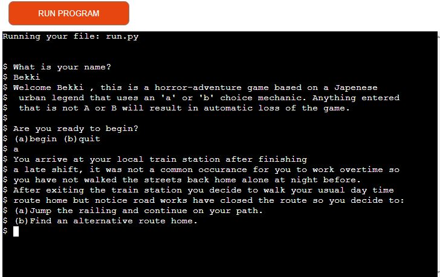

# Horror Adventure Game
This project is a horror story game that has multiple branches available, the story is loosely based on a Japanese horror story known as the "Teke-Teke".
The premise of the story is the user must pick the correct answer to get themselves home safely.

## Features
The game features a choice based adventure in which you play the main character and you have to guide yourself home safely and not get caught by the creature.
- You choose how to proceed by answering a or b to the decision prompts.
- Anything other than a or b will result in a game over and string of text telling the user what to press.

### Name input
- This is the section where the user is asked for their name to personalize the welcoming screen.

 

### Welcome screen
- This is the welcome screen to welcome the user to the game, ask then their name and if they like to begin.

 

### Quit message prompt
- This is an example to show what happens when the user clicks to quit option at the beginning of the game.

 

### First decision question
- This the first decision question asked to the user and dictates what path they will be starting on in the story.

### Game over example
- This is an example of one of the bad ends in the game an, there are 9 endings in total throughout the story.

### Invalid input example
- This a message that appears when the player types anything other than A or B.
- there a multiple invalid messages throughout the game to keep it interesting adds for replayability if the user wishes to see them all.

 

 **Features left to add**
    - I would like to branch out and create many more endings and story routes to the game.
    - Add more opportunities in the story for the user to personalize it further.
    - Include longer and more descriptive ending sequences.

## Program Structure
- This is the original draft flow chart for the project, I wanted to make multiple branches to tell the story.
- A few branches have been changed but the premise is still the same.

 

- This is the re-done flow chart to show how to get to each branch ending and how they were labeled throughout to ensure the proper structure could be followed making it in gitpod.
- Some of the text has been changed from the original draft but this is the final chart to help reach all endings.

 

 ## Testing
- Issues faced

- Deployment Issues
    - Issues I had faced after deployment of website was that all hyperlinks were broken and giving a 404 message.
    Through slack and very helpful individuals in my course I finally spotted the issue which was a foward slash on my hyperlinks causing the 404 error. I removed them and pushed the website which solved the issue.

- Summary
    - In relation to testing the feedback provided from the participants was extremely useful in the development of the media queries and the pages overall funtionality. 

### Validator Testing 
- I used PEP8 to validate my python code.
- I manually tested every section of the game to make sure it played well
  and all the decision branches lined up well. 
  
    

  ## Deployment 

- The game was deployed through Heroku 
  - I went on to the Heroku website 
  - Clicked on "Create-New-App"
  - Named my project and stated what region I live in
  - I clicked into settings 
  - Added the Python and Nodejs buildpack
  - Clicked into Deploy 
  - Connected to my GitHub
  - Searched for my project name repository and clicked connect
  - Enabled automatic deploys
  - Clicked "Deploy Branch" 

  The live link to Horror-Adventure-Game can be found here - https://horror-adventure-game.herokuapp.com/

  ## Credits

- https://www.sitepoint.com/ 
    - What was used from this site was a guide on the structural layout of JavaScript, e.g fuctions, variables, etc.
- https://favicon.io/
    - This site was used to get the favicon.ico image for the website
- Fonts used throughout website was taken from Google Fonts https://fonts.google.com/

## Acknowledgements

I want to thank my Fiance who kept pushing me to keep bettering myself and not letting me give up and for giving me advice on how get the readme to sound more structured and professional.
Fellow students for letting me vent frustrations when I felt overwhelmed with the work.
Kasia who keeps up our morale and always checks to see if we are doing okay and finally my mentor for guiding me pushing me to do more challeging work.

